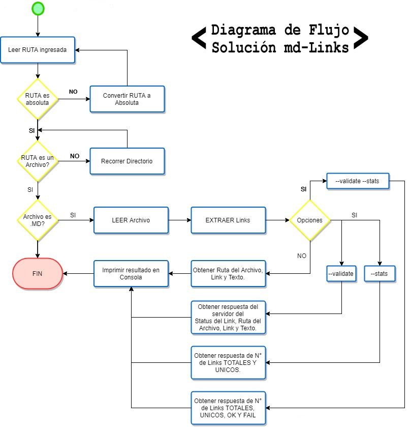
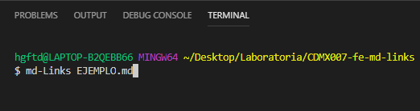
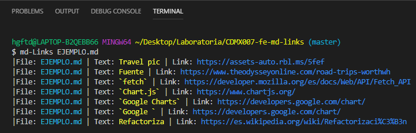
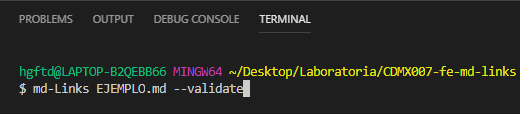
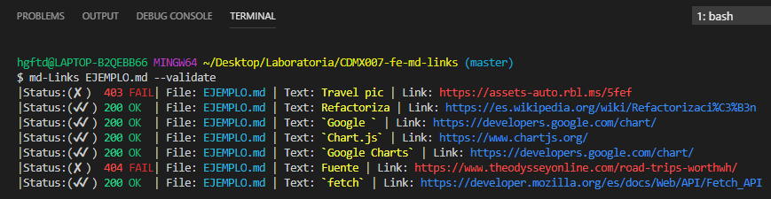
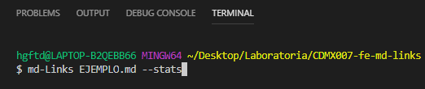
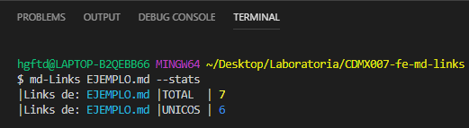
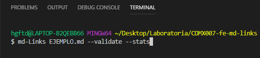
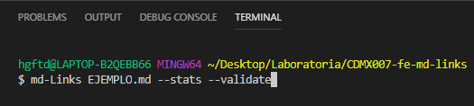
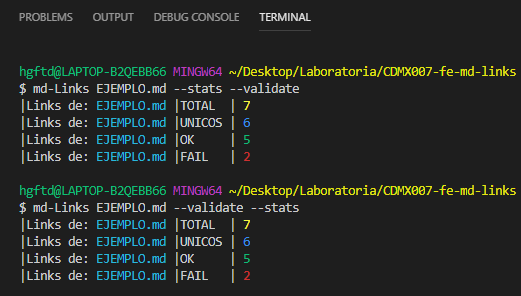

# Markdown Links

## Preámbulo

[Markdown](https://es.wikipedia.org/wiki/Markdown) es un lenguaje de marcado
ligero muy popular entre developers. Es usado en muchísimas plataformas que
manejan texto plano (GitHub, foros, blogs, ...), y es muy común
encontrar varios archivos en ese formato en cualquier tipo de repositorio
(empezando por el tradicional `README.md`).

Estos archivos `Markdown` normalmente contienen _links_ (vínculos/ligas) que
muchas veces están rotos o ya no son válidos y eso perjudica mucho el valor de
la información que se quiere compartir.

Dentro de una comunidad de código abierto, nos han propuesto crear una
herramienta usando [Node.js](https://nodejs.org/), que lea y analice archivos
en formato `Markdown`, para verificar los links que contengan y reportar
algunas estadísticas.

## Diagrama de Flujo

A continuación, se muestra el diagrama de flujo con ek algoritmo para la implementación de la solución de md-Links.

## Documentación técnica de la librería.

Las herramientas y dependencias implementadas para la construcción de esta Librería fueron las siguientes:

|Especificaciones técnicas|
| ---------------------- |
| **Lenguaje**           |
|JavaScript ECMAScript 6|
| **Ejecución**           |
|Node.js|
| **Dependencias y modulos NPM**|
|chalk                   |
|node-fetch              |
|File System             |
|Path                    |
| **Testing**            |
| Jest (pruebas unitarias)                    |
| **Otros**              |
|RegEX                   |
|module.exports|
|Línea de comando CLI|

## Instalación de la librería
Podemos instalar directamente desde GitHub con el comando:

`npm install erandicvc-md-links`

Sí se quiere implementar globalmente. Puede instalarse via:

 `npm install --global erandicvc-md-links`

 ó 
 
 `npm i --global erandicvc-md-links`

Este módulo incluye ejecutable y una interfaz que podamos importar con `require` para usarlo programáticamente.

## Guía de Uso:  

### CLI (Command Line Interface - Interfaz de Línea de Comando)

El ejecutable de nuestra aplicación se puede ejecutar de la siguiente
manera a través de la terminal:

`md-Links <path-to-file> [options]`

Por ejemplo:

Resultado:

El comportamiento por defecto no valida si las URLs responden ok o no,
solo debe identifica el archivo markdown (a partir de la ruta que recibe como
argumento), analizar el archivo Markdown e imprimir los links que vaya
encontrando, junto con la ruta del archivo donde aparece y el texto
que hay dentro del link (truncado a 50 caracteres).

#### Options

##### `--validate`

Si pasamos la opción `--validate`, el módulo hace una petición HTTP para
averiguar si el link funciona o no. Si el link resulta en una redirección a una
URL que responde ok, entonces consideraremos el link como ok.

Por ejemplo:

Resultado:

Vemos que el _output_ en este caso incluye la palabra `OK` o `FAIL`, así como el status de la respuesta recibida a la petición HTTP a dicha
URL.

##### `--stats`

Si pasamos la opción `--stats` el output (salida) será un texto con estadísticas
básicas sobre los links.

Por ejemplo:

Resultado:

También podemos combinar `--stats` y `--validate` ó `--validate` y `--stats` para obtener estadísticas que
necesiten de los resultados de la validación.

Por ejemplo:

ó

Resultado:

## Autor

- Erandi Carolina Vázquez Cuervo

